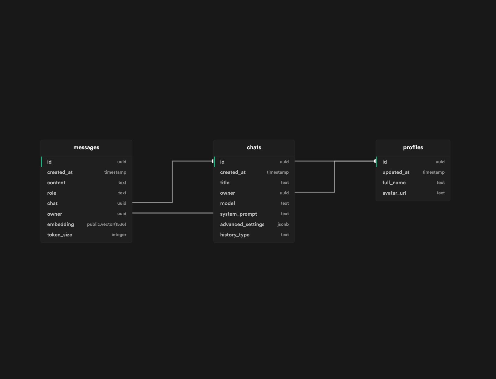

# Nimble.AI

Nimble.AI is a ChatGPT clone with enhanced features for makers built on top of using Next.js, TypeScript, Supabase, Jotai and Tailwind CSS.


## Running Locally

**1. Create a Supabase Project**
The application holds conversations in a Supabase database. You can create a free account [here](https://supabase.io/).

Nimble.AI needs a Supabase URL and Supabase Anon Key to connect to your database. You can find these in your Supabase project settings.

You must create 3 tables in your supabase project:



You can create all the tables you need with the `sql function` that I am listing below here;

Create-Table : 
```
create table profiles (
  id uuid default uuid_generate_v4() primary key,
  updated_at timestamp default now(),
  full_name text,
  avatar_url text
);

create table chats (
  id uuid default uuid_generate_v4() primary key,
  created_at timestamp default now(),
  title text,
  owner uuid references profiles (id),
  model text,
  system_prompt text,
  advanced_settings jsonb,
  history_type text
);

create table messages (
  id uuid default uuid_generate_v4() primary key,
  created_at timestamp default now(),
  content text,
  role text,
  chat uuid references chats (id),
  owner uuid references profiles (id),
  embedding public.vector(1536),
  token_size integer
);


```

Create-Messages :
```
CREATE OR REPLACE FUNCTION search_messages (
  query_embedding vector(1536),
  similarity_threshold float,
  match_count int,
  owner_id uuid,
  chat_id uuid DEFAULT NULL
)
RETURNS TABLE (
  content text,
  role text,
  created_at timestamp with time zone
)
LANGUAGE plpgsql
AS $$
BEGIN
  RETURN QUERY
  SELECT
    messages.content,
    messages.role,
    messages.created_at::timestamp with time zone
  FROM messages
  WHERE
    messages.owner = owner_id AND
    (chat_id IS NULL OR messages.chat = chat_id) AND
    1 - (messages.embedding <=> query_embedding) > similarity_threshold
  ORDER BY
    1 - (messages.embedding <=> query_embedding) DESC,
    messages.created_at
  LIMIT match_count;
END;
$$;
```

Create-Profile :
```
-- inserts a row into public.users
create function public.handle_new_user()
returns trigger
language plpgsql
security definer set search_path = public
as $$
begin
  insert into public.profiles (id, full_name, avatar_url)
  values (new.id, new.raw_user_meta_data ->> 'user_name', new.raw_user_meta_data ->> 'avatar_url');
  return new;
end;
$$;

-- trigger the function every time a user is created
create trigger on_auth_user_created
  after insert on auth.users
  for each row execute procedure public.handle_new_user();
```

Create-Index :
```
create index on messages 
using ivfflat (embedding vector_cosine_ops)
with (lists = 100);
```

**2. Clone The Repo**

```bash
git clone https://github.com/thakoorchandan/NimbleBox_ChatNBX.git
```

**3. Install Dependencies**

```bash
yarn install
```

**4. Create Your Enviroment Variables**

Create your .env.local file in the root of the repo with your Supabase URL, Supabase Anon Key, Auth Redirect URL and OpenAI API Key:

```bash
NEXT_PUBLIC_SUPABASE_URL=YOUR_URL *required
NEXT_PUBLIC_SUPABASE_ANON_KEY=YOUR_KEY *required
NEXT_PUBLIC_AUTH_REDIRECT_URL=YOUR_URL *required
OPENAI_API_KEY=YOUR_KEY *optional
```

**4.1 Creating .env File**

1. Locate the file named `.env.example` in the main folder.
2. Create a copy of this file, called `.env` by removing the `template` extension. The easiest way is to do this in a command prompt/terminal window `cp .env.example .env`.
3. Open the `.env` file in a text editor. _Note: Files starting with a dot might be hidden by your Operating System._
4. Change environment variables as needed.
5. Save and close the `.env` file.

**4.2 OpenAI API Key**

When you set your `OpenAI API Key` as an environment variable, the application will not prompt you to enter it again to initialize itself. <span style="color:red; font-weight:bold;">BE CAREFUL</span> if you set your `OpenAI API Key` as an environment variable and host it anybody who accesses your hosted version can use it. If you don't have an `OpenAI API Key`, you can get one [here](https://platform.openai.com/account/api-keys).

**4.3 Auth Redirect URL**

You must set your `Auth Redirect URL` on production as environment variable. If you don't set it, you will get an error when you try to sign in. Also, make sure you have the right `Auth Redirect URL` set in your Supabase project settings and in your environment variables that you created for Vercel. If you have different `Auth Redirect URL` for preview and production, you can set them as environment variables in Vercel and Supabase.

**5. Run Development Server**

```bash
yarn dev
```

## Configuration

When deploying the application, the following environment variables can be set:

| Environment Variable          | Required         | Description                            |
| ----------------------------- | ---------------- | -------------------------------------- |
| NEXT_PUBLIC_SUPABASE_URL      | Yes              | The base url of your Supabase Project  |
| NEXT_PUBLIC_SUPABASE_ANON_KEY | Yes              | The Anon Key for your Supabase Project |
| NEXT_PUBLIC_AUTH_REDIRECT_URL | Yes (Production) | The base url of your Supabase Project  |
| OPENAI_API_KEY                | Optional         | The Anon Key for your Supabase Project |

If you don't have an OpenAI API key, you can get one [here](https://platform.openai.com/account/api-keys).

## Contact

If you have any questions, feel free to reach out to me on [LinkedIn](https://www.linkedin.com/in/thakoor-chandan).